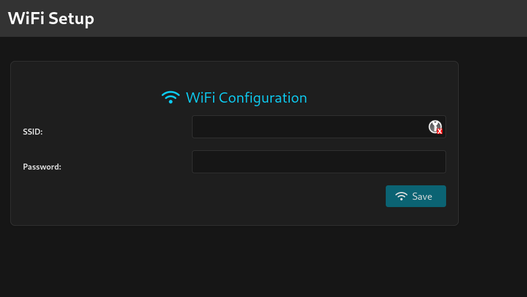
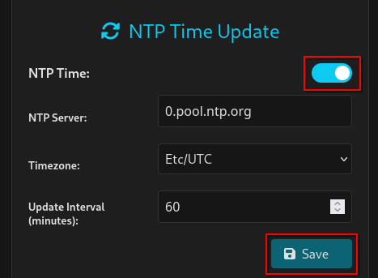
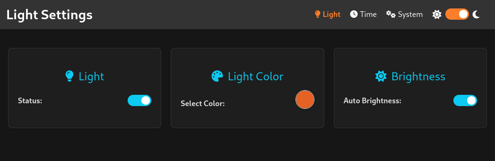
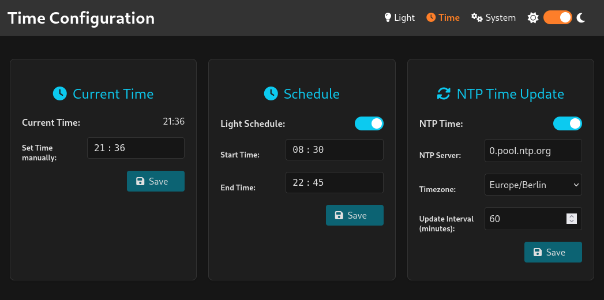
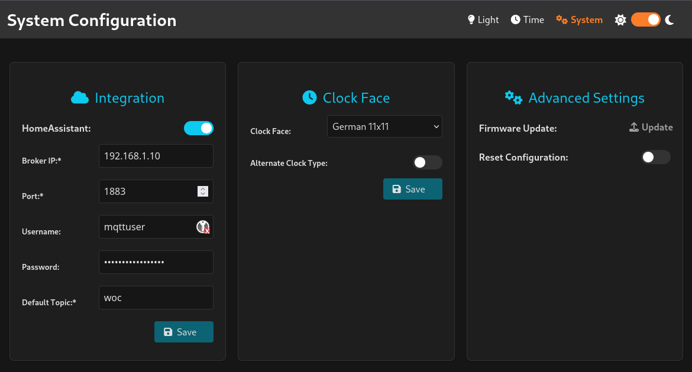
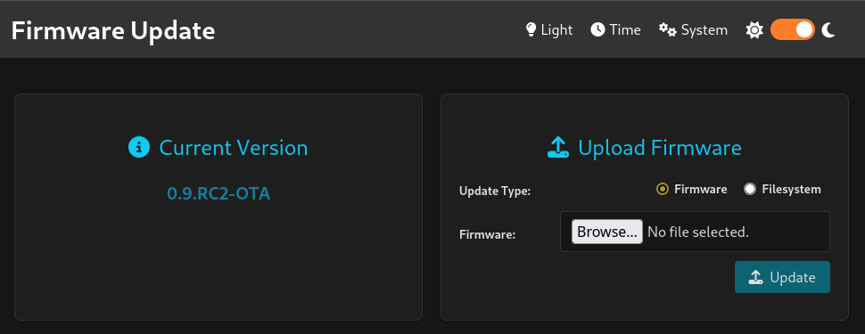

# Getting Started with Word-o-Clock

## Basic Configuration

### First Power-Up

When you start your Word-o-Clock for the first time, follow these steps to get started:

1. **Power Connection**
   - Connect your Word-o-Clock to a power source using a USB-C cable
   - Use a modern, PD-capable USB charger (5V/2A recommended)

2. **WiFi Setup**
   - The clock will create its own WiFi network named `word-o-clock`
   - Connect to this network using the password: `w0Rd0Cl0cK`
   - Open a web browser and navigate to `192.168.4.1`
   - You'll see the WiFi setup page where you can enter your home network credentials
   - After saving, the clock will restart and connect to your network

### Accessing the Web Interface
Once connected to your network:
1. Find your Word-o-Clock's IP address by:
   - Checking your router's DHCP client list
   - Using network discovery tools
   - Looking for a device named "word-o-clock"
2. Open that IP address in your web browser

## Basic Configuration

### Navigation

The web interface is organized into pages for different functions:

1. **Available Pages**
   - Light (`/` and `/light`): Control state, brightness, color, and auto-brightness
   - Time (`/time`): Set time manually, daily light schedule, and NTP settings
   - System (`/system`): Configure MQTT, clockface, and system settings
   - Firmware Update (`/update`): Accessible via System → Update

2. **Dark Mode**
   - Light/Dark Mode toggle in the header

### Saving Changes

   - Toggle switches off usually takes effect immediately
   - Turning on a switch sometimes requires additional parameters, so you have to use the save button to save the toggle state
   - Some changes may restart the device

### Light Control

The Light page lets you control the appearance of your word clock:

1. **Basic Controls**
   - On/Off toggle for the entire LED matrix
   - Color picker for selecting any RGB color
   - Brightness slider (0-255) (only available when auto brightness is turned off)

2. **Auto-brightness**
   - Toggle to enable/disable
   - Uses built-in light sensor to automatically adjusts brightness based on ambient light

### Time Settings

Configure how your Word-o-Clock keeps time:

1. **Manual Time Setting**
   - Set the current time manually if needed
   - Uses 24-hour format
   - Syncs with internal RTC
   - does not turn off NTP, if you want to keep your manual time turn off the ntp feature as well!

2. **Light Schedule**
   - Set daily on/off times
   - Uses 24-hour format
   - a schedule is only triggered by the start time, so creating a schedule in its scheduled time will not run schedule before the next day

3. **NTP Configuration**
   - Server: Default is pool.ntp.org
   - Timezone selection from dropdown, default is Etc/UTC
   - Update interval (in minutes)
   - the system uses `1.pool.ntp.org` and `2.pool.ntp.org` as hard-coded backup servers

### System Settings

Advanced configuration options:

1. **MQTT Integration**
   - Enable/disable Home Assistant integration
   - Broker settings:
     - IP address or hostname
     - Port, default is `woc`
     - Optional username/password
     - Topic prefix, default is `woc`
   - Auto-discovers in Home Assistant via Home Assistant MQTT integration

2. **Clock Face Options**
   - Choose clockface format or language
   - Toggle between standard/regional time format
   - Currently supports German 11x11 layout, more clockfaces can be added

3. **System Maintenance**
   - Link to firmware update web interface
   - Factory reset option

### Firmware Update

Update the firmware or data directory:
   - Build the project yourself or fetch a release
   - use **Firmware** for `firmware.bin` files
   - use **Filesystem** for `filesystem.bin` files
   - Update and wait for the restart. Reload the browser.

## Troubleshooting

### Common Issues

1. **WiFi Connection Problems**
   - Only supports 2.4 GHz networks
   - Double-check credentials
   - Check antenna connection if applicable (e.g, a model with an U.FL / SMA connector)
   - Retry setup if connection fails

2. **Time Synchronization Issues**
   - Verify internet connectivity
   - Check NTP server accessibility
   - Adjust sync interval if needed
   - Replace RTC battery if time lost on power down

3. **LED Display Problems**
   - Auto-brightness can conflict with time updates, try disabling auto-brightness temporarily
   - Check power supply capacity
   - Verify color/brightness settings

4. **Home Assistant Integration**
   - Verify MQTT broker settings
   - Check broker accessibility
   - Confirm topic prefix
   - Look for connection logs

### Support
- Report issues on [GitHub](https://github.com/mplogas/word-oclock/issues)
- Check for [firmware updates](https://github.com/mplogas/word-oclock/releases) regularly
- Read the technical documentation (RTFM):
  - [Features](./features.md)
  - [API Endpoints](./endpoints.md)
  - [DE Clock Face](./timeconverterde.md)
- if you have me on Signal, ping me :)

